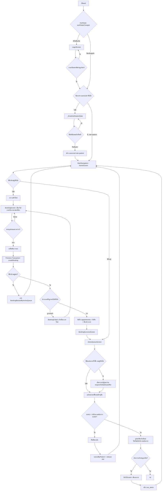
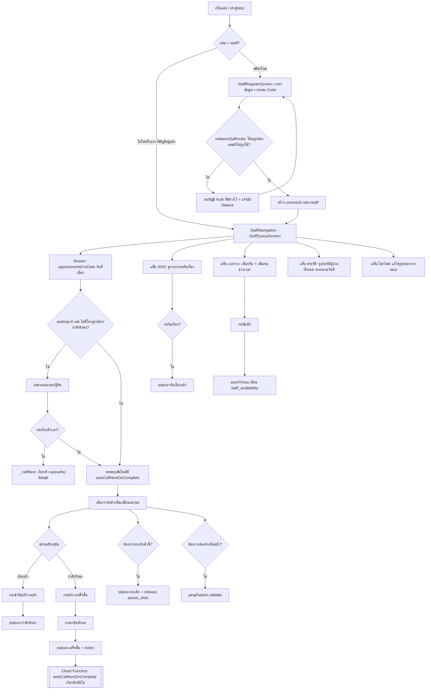
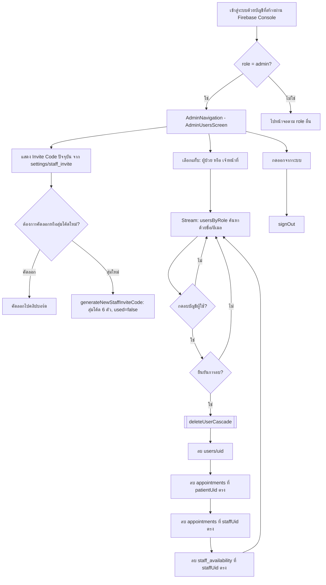

# ข้อมูลดิบสำหรับบทที่ 3 (วิธีดำเนินการวิจัย)
### โครงการ: Healthcare Station — แอปพลิเคชันจองคิวเข้ารับบริการเครื่อง Safe Walk

> เอกสารนี้เป็นการ **สำรวจซอร์สโค้ดจริง** ในโปรเจกต์ (ไม่ใช่เนื้อหาบทที่ 3 ที่เขียนเสร็จแล้ว) จัดทำขึ้นเพื่อให้ผู้เขียนโครงการนำไปประกอบการเขียนบทที่ 3 ต่อ ทุกรายการอ้างอิงจากไฟล์จริงในโปรเจกต์ ณ วันที่ 2026-08-29 ส่วนใดที่หาไม่พบในโค้ดจะระบุไว้อย่างชัดเจนว่า **"ยังไม่พบในโค้ด / ยังไม่ได้พัฒนา"**

---

## 1. รายการฟังก์ชันของระบบ แยกตามบทบาทผู้ใช้ (Functional Requirements)

### 1.1 ผู้เข้ารับบริการกายภาพบำบัด (Patient)

| # | ฟังก์ชัน | ไฟล์/หน้าจอที่เกี่ยวข้อง |
|---|---|---|
| P1 | สมัครสมาชิก (สร้างบัญชี Firebase Auth ด้วยอีเมล/รหัสผ่าน) | `lib/features/auth/register_screen.dart` |
| P2 | ยืนยันอีเมล (บังคับก่อนเข้าใช้งานแอป, สร้าง `users/{uid}` เมื่อยืนยันสำเร็จ) | `lib/app/app.dart` (`_EmailVerificationGate`), `lib/core/widgets.dart` (`EmailVerificationBanner`) |
| P3 | เข้าสู่ระบบ | `lib/features/auth/login_screen.dart` |
| P4 | ออกจากระบบ | `lib/features/patient/profile_screen.dart` (`_confirmLogout`) |
| P5 | ดูสถานะคิววันนี้ของตนเองแบบเรียลไทม์ (หน้าแรก) | `lib/features/patient/home_screen.dart` |
| P6 | จองคิวใหม่ (เลือกวันที่ → เวลา → นักกายภาพ → เครื่อง) | `lib/features/patient/booking_screen.dart` (`BookingScreen`) |
| P7 | ดูผลการจองคิวสำเร็จ (เลขคิว/วัน/เวลา/เครื่อง) | `lib/features/patient/booking_screen.dart` (`BookingSuccessScreen`) |
| P8 | ยกเลิกคิวของตนเอง (เฉพาะสถานะ "กำลังรอ") | `lib/features/patient/home_screen.dart`, `active_queue_screen.dart` (`_confirmCancel` → `AppointmentService.cancelByPatient`) |
| P9 | ติดตามความคืบหน้าคิว (ขั้นตอน: ลงทะเบียน → รอ → เรียกคิว → รับการรักษา) | `lib/features/patient/active_queue_screen.dart` |
| P10 | ตอบรับ/ปฏิเสธข้อเสนอ "มาเร็วขึ้น" เมื่อคิวก่อนหน้าไม่มาตามนัด | `lib/core/widgets.dart` (`NoShowOfferBanner`), `lib/services/noshow_offer_service.dart` |
| P11 | ดูประวัติการรักษาทั้งหมดของตนเอง + ดูรายละเอียดแต่ละครั้ง | `lib/features/patient/history_screen.dart` |
| P12 | ดูรายการแจ้งเตือน + ทำเครื่องหมายอ่านแล้ว | `lib/features/patient/notification_screen.dart` |
| P13 | แจ้งเหตุฉุกเฉิน (SOS) พร้อมระบุอาการ | `lib/features/patient/sos_screen.dart` |
| P14 | ดู/แก้ไขโปรไฟล์ (อัปโหลดรูปโปรไฟล์) | `lib/features/patient/profile_screen.dart` |
| P15 | ลบบัญชีและข้อมูลของตนเอง (สิทธิ PDPA, ต้องยืนยันรหัสผ่านซ้ำ) | `lib/features/patient/profile_screen.dart` (`_confirmDeleteAccount`, `_showReauthDialog`), `lib/services/user_service.dart` (`deleteOwnAccount`) |
| P16 | รับการแจ้งเตือนแบบ Push (FCM) และแตะเพื่อนำทางไปหน้าที่เกี่ยวข้อง | `lib/services/fcm_service.dart`, `lib/app/app.dart` (`routeFromNotification`) |
| P17 | ดูสถานะเครื่องกายภาพบำบัดแบบเรียลไทม์ (ทำงาน/ว่าง/ไม่ทราบสถานะ) ตอนจองคิว | `lib/core/widgets.dart` (`MachineStatusCard`), `booking_screen.dart` (ขั้นตอนที่ 4) |

### 1.2 เจ้าหน้าที่ (Staff)

| # | ฟังก์ชัน | ไฟล์/หน้าจอที่เกี่ยวข้อง |
|---|---|---|
| S1 | สมัครบัญชีเจ้าหน้าที่ด้วย Invite Code (ออกโดยแอดมิน) | `lib/features/auth/staff_register_screen.dart`, `lib/services/staff_invite_service.dart` |
| S2 | เข้าสู่ระบบ / ออกจากระบบ | ใช้ร่วมกับ `login_screen.dart` / `profile_screen.dart` |
| S3 | ดูรายการคิวของวันนี้/วันอื่น พร้อมค้นหาชื่อ-เลขคิว และกรองตามสถานะ | `lib/features/staff/staff_queue_screen.dart` |
| S4 | เปลี่ยนสถานะคิว (เรียกคิว → กำลังรักษา → เสร็จสิ้น, หรือยกเลิก) พร้อม "เลิกทำ" (undo) | `staff_queue_screen.dart` (`_changeStatus`) |
| S5 | เรียกคิวถัดไปด้วยตนเอง (ปุ่มกู้คืน เมื่อระบบอัตโนมัติยังไม่ทำงาน/คิวแรกของวัน) | `staff_queue_screen.dart` (`_callNext`) |
| S6 | บันทึกผลการรักษา/หมายเหตุ ตอนกดเสร็จสิ้น | `staff_queue_screen.dart` (`_completeDialog`) |
| S7 | ส่งแจ้งเตือนซ้ำ (ping) ให้ผู้ป่วยที่ถูกเรียกคิวแล้ว | `staff_queue_screen.dart` (`_pingPatient`), `lib/services/staff_notify_service.dart` |
| S8 | ดูรายการแจ้งเหตุฉุกเฉิน (SOS) ที่รอรับเรื่อง และกดรับเรื่อง | `lib/features/staff/staff_sos_screen.dart` |
| S9 | ดูประวัติ SOS ที่รับเรื่องแล้ว | `staff_sos_screen.dart` (`_history`) |
| S10 | ดูประวัติการรักษาของผู้ป่วยทั้งหมด (กรองตามวันที่) | `lib/features/staff/staff_history_screen.dart` |
| S11 | ตั้ง/แก้ไขเวลาว่างของตนเองรายวัน (ล่วงหน้า 14 วัน) | `lib/features/staff/staff_availability_screen.dart`, `lib/services/availability_service.dart` |
| S12 | ดู/แก้ไขโปรไฟล์ (ใช้ร่วมกับผู้ป่วย) | `lib/features/patient/profile_screen.dart` |
| S13 | รับการแจ้งเตือน Push เมื่อมีการจอง/ยกเลิกคิว/มี SOS ใหม่ | `lib/services/fcm_service.dart` |

### 1.3 ผู้ดูแลระบบ (Admin)

| # | ฟังก์ชัน | ไฟล์/หน้าจอที่เกี่ยวข้อง |
|---|---|---|
| A1 | เข้าสู่ระบบ / ออกจากระบบ (บัญชีแอดมินสร้างผ่าน Firebase Console เท่านั้น ไม่มีหน้าสมัครในแอป) | `lib/features/admin/admin_users_screen.dart` |
| A2 | ดูรายชื่อผู้ป่วย และรายชื่อเจ้าหน้าที่ (แยกแท็บ) พร้อมค้นหาชื่อ/อีเมล | `lib/features/admin/admin_users_screen.dart` (`_userList`) |
| A3 | ลบบัญชีผู้ใช้ (ลบแบบ cascade: บัญชี + คิวที่เกี่ยวข้อง + เวลาว่างถ้าเป็นเจ้าหน้าที่) | `admin_users_screen.dart` (`_deleteUser`), `lib/services/user_service.dart` (`deleteUserCascade`) |
| A4 | ดู/คัดลอก/สุ่มสร้าง Invite Code ใหม่สำหรับการสมัครบัญชีเจ้าหน้าที่ | `admin_users_screen.dart` (`_generateCode`), `user_service.dart` (`generateNewStaffInviteCode`) |

### 1.4 ฟังก์ชันอัตโนมัติของระบบ (Cloud Functions — ไม่ผูกกับหน้าจอ/บทบาทใดโดยตรง)

อยู่ใน `functions/src/index.ts` ทั้งหมด (Firestore Trigger + Scheduled Function):

| ฟังก์ชัน | ประเภท | หน้าที่ |
|---|---|---|
| `onQueueCalled` | Firestore trigger (`onDocumentUpdated`, `appointments/{id}`) | ส่ง push แจ้งผู้ป่วยเมื่อสถานะเปลี่ยนเป็น "เรียกคิว" |
| `autoCallNextOnComplete` | Firestore trigger | เรียกคิวถัดไปอัตโนมัติ (เรียงตาม queueNo) เมื่อคิวก่อนหน้า "เสร็จสิ้น" หรือถูกยกเลิกขณะเรียก/รักษาอยู่ |
| `onBookingCreated` | Firestore trigger (`onDocumentCreated`) | แจ้งเจ้าหน้าที่เมื่อมีการจองคิวใหม่ในตารางของตน |
| `onBookingCancelled` | Firestore trigger | แจ้งฝ่ายที่เกี่ยวข้องเมื่อคิวถูกยกเลิก (ข้อความต่างกันตาม `cancelledBy`: patient/staff/system_late/system_noshow) |
| `onSosCreated` | Firestore trigger (`sos_alerts/{id}`) | แจ้งเตือนเจ้าหน้าที่ทุกคนเมื่อมี SOS ใหม่ |
| `morningReminders` | Scheduled (cron `0 7 * * *` เวลาไทย) | แจ้งเตือนผู้ป่วยที่มีคิว "กำลังรอ" ในวันนั้นตอน 7 โมงเช้า |
| `checkLateAppointments` | Scheduled (ทุก 2 นาที) | ตรวจจับ+ยกเลิกอัตโนมัติคิวที่มาสายเกิน 5 นาที หรือถูกเรียกแล้วไม่มาเช็คอินภายใน 10 นาที และส่งข้อเสนอ "มาเร็วขึ้น" ให้คิวถัดไป |
| `respondToNoShowOffer` | Callable | ผู้ป่วยตอบรับ/ปฏิเสธข้อเสนอ "มาเร็วขึ้น" |
| `redeemStaffInvite` | Callable | ตรวจสอบ+เผา Invite Code และสร้าง `users/{uid}` (role: staff) ฝั่งเซิร์ฟเวอร์ |
| `pingPatient` | Callable | ให้เจ้าหน้าที่ส่งแจ้งเตือนซ้ำแบบ manual |

---

## 2. รายชื่อหน้าจอทั้งหมดในแอป (สำหรับทำ UI Wireframe)

| # | ไฟล์ | Widget | บทบาท | คำอธิบาย / อินพุต-เอาต์พุต |
|---|---|---|---|---|
| 1 | `lib/features/auth/login_screen.dart` | `LoginScreen` | ทุกบทบาท | หน้าเข้าสู่ระบบ อินพุต: อีเมล/รหัสผ่าน; เอาต์พุต: นำทางเข้า `AuthGate` (สำเร็จ) หรือ snackbar error (ล้มเหลว); มีลิงก์ไปสมัครสมาชิก/สมัครนักกายภาพ |
| 2 | `lib/features/auth/register_screen.dart` | `RegisterScreen` | Patient | สมัครสมาชิกผู้ป่วย อินพุต: ชื่อ-นามสกุล/อีเมล/รหัสผ่าน (≥6 ตัว); เอาต์พุต: สร้างบัญชี Auth + ส่งอีเมลยืนยัน (ยังไม่เขียน Firestore) |
| 3 | `lib/features/auth/staff_register_screen.dart` | `StaffRegisterScreen` | Staff | สมัครบัญชีเจ้าหน้าที่ อินพุต: ชื่อ/ความเชี่ยวชาญ/อีเมล/รหัสผ่าน/Invite Code; เอาต์พุต: สร้างบัญชี Auth + เรียก callable `redeemStaffInvite` |
| 4 | `lib/features/patient/main_navigation.dart` | `MainNavigation` | Patient | Bottom navigation หลัก 4 แท็บ: หน้าแรก/คิวของฉัน/ประวัติ/โปรไฟล์ — ไม่มีอินพุต/เอาต์พุตของตัวเอง เป็นตัวสลับหน้าจอ |
| 5 | `lib/features/patient/home_screen.dart` | `HomeScreen` | Patient | หน้าแรก: การ์ดคิววันนี้ (เรียลไทม์), ปุ่มจองคิว/ประวัติ, บริการ (กายภาพบำบัด/แจ้งเตือน/SOS), แบนเนอร์ข้อเสนอ "มาเร็วขึ้น" |
| 6 | `lib/features/patient/booking_screen.dart` | `BookingScreen` | Patient | จองคิว 4 ขั้นตอน (วันที่ → เวลา → นักกายภาพ → เครื่อง) อินพุต: การเลือกในแต่ละขั้น; เอาต์พุต: สร้างเอกสาร `appointments` ผ่าน transaction |
| 6.5 | `lib/features/patient/booking_screen.dart` | `BookingSuccessScreen` | Patient | สรุปผลจองคิวสำเร็จ (เลขคิว/นักกายภาพ/วัน/เวลา/เครื่อง) เอาต์พุตอย่างเดียว ไม่มีอินพุต |
| 7 | `lib/features/patient/active_queue_screen.dart` | `ActiveQueueScreen` | Patient | คิวปัจจุบันของตนเอง + แถบความคืบหน้า 4 ขั้น + ปุ่มยกเลิกคิว (ถ้ายัง "กำลังรอ") + แบนเนอร์ข้อเสนอมาเร็วขึ้น |
| 8 | `lib/features/patient/history_screen.dart` | `HistoryScreen` | Patient | รายการประวัติการจองทั้งหมดของตนเอง กดแต่ละรายการเพื่อดูรายละเอียด (dialog) |
| 9 | `lib/features/patient/profile_screen.dart` | `ProfileScreen` | Patient + Staff (ใช้ไฟล์ร่วมกัน) | โปรไฟล์: รูป/ชื่อ/อีเมล/บทบาท, อัปโหลดรูป (อินพุต: รูปจากแกลเลอรี), ออกจากระบบ, ลบบัญชี (เฉพาะ patient, ต้องกรอกรหัสผ่านยืนยันซ้ำ) |
| 10 | `lib/features/patient/notification_screen.dart` | `NotificationScreen` | Patient + Staff (ใช้ไฟล์ร่วมกัน) | รายการแจ้งเตือนทั้งหมดของผู้ใช้ อินพุต: กดเพื่อ mark read; เอาต์พุต: อัปเดต `notifications.read` |
| 11 | `lib/features/patient/sos_screen.dart` | `SOSScreen` | Patient | แจ้งเหตุฉุกเฉิน อินพุต: เลือกอาการ (radio) หรือระบุเอง; เอาต์พุต: สร้างเอกสาร `sos_alerts` |
| — | `lib/features/staff/staff_navigation.dart` | `StaffNavigation` | Staff | Bottom navigation หลัก 5 แท็บ: จัดการคิว/SOS/ประวัติ/เวลาว่าง/โปรไฟล์ |
| — | `lib/features/staff/staff_queue_screen.dart` | `StaffQueueScreen` | Staff | จัดการคิว: สถิติวันนี้ (รอ/เรียกแล้ว/รับบริการ), เลือกวัน, ค้นหา, กรองสถานะ, การ์ดคิวพร้อมปุ่มเปลี่ยนสถานะ+ping, แบนเนอร์กู้คืนคิว |
| — | `lib/features/staff/staff_sos_screen.dart` | `StaffSOSScreen` | Staff | แท็บ "รอรับเรื่อง"/"ประวัติ SOS" อินพุต: กดรับเรื่อง; เอาต์พุต: อัปเดต `sos_alerts.status` |
| — | `lib/features/staff/staff_history_screen.dart` | `StaffTreatmentHistoryScreen` | Staff | ประวัติการรักษาของผู้ป่วยทุกคน กรองตามวันที่ที่เลือก |
| — | `lib/features/staff/staff_availability_screen.dart` | `StaffAvailabilityScreen` | Staff | ตั้งเวลาว่างล่วงหน้า 14 วัน อินพุต: เลือกวัน + เพิ่ม/ลบช่วงเวลา (time picker); เอาต์พุต: บันทึก `staff_availability` |
| — | `lib/features/admin/admin_navigation.dart` | `AdminNavigation` | Admin | ตัวสลับหน้าจอแอดมิน (ปัจจุบันมีหน้าเดียว) |
| — | `lib/features/admin/admin_users_screen.dart` | `AdminUsersScreen` | Admin | จัดการ Invite Code + รายชื่อผู้ใช้ 2 แท็บ (ผู้ป่วย/เจ้าหน้าที่) พร้อมค้นหาและลบบัญชี |
| — | `lib/app/app.dart` | `AuthGate`, `_EmailVerificationGate` | ทุกบทบาท | ไม่ใช่หน้าจอเชิงฟังก์ชัน แต่เป็นตัวตัดสิน routing ตามสถานะล็อกอิน/role/การยืนยันอีเมล — รวมไว้เพราะมี UI ของตัวเอง (หน้ารอยืนยันอีเมล) |

**หมายเหตุ:** ปุ่ม/วิดเจ็ตที่ใช้ร่วมกันหลายหน้าไม่นับเป็นหน้าจอแยก ได้แก่ `StateMessage`, `MachineStatusCard`, `NoShowOfferBanner`, `EmailVerificationBanner`, `icon3D` (ทั้งหมดใน `lib/core/widgets.dart`)

---

## 3. Data Dictionary ของฐานข้อมูล (Firestore Collections)

อ้างอิงจากจุดเรียก `.collection()` จริงในโค้ด (`lib/services/*.dart`, `functions/src/index.ts`) — **ไม่มี model class แบบ typed สำหรับเอกสาร Firestore แต่ละชนิด** ข้อมูลถูกอ่าน/เขียนผ่าน `Map<String, dynamic>` โดยตรง

### 3.1 `users/{uid}`
| Field | Type | คำอธิบาย | หมายเหตุ |
|---|---|---|---|
| uid | String | UID ของผู้ใช้ (ตรงกับ Firebase Auth) | Primary key = document ID |
| fullname | String | ชื่อ-นามสกุล | |
| email | String | อีเมล | |
| role | String | `patient` \| `staff` \| `admin` | ห้ามเปลี่ยนเองผ่าน client (ดู firestore.rules) |
| specialization | String | ความเชี่ยวชาญ (เฉพาะ staff) | optional |
| photoBase64 | String | รูปโปรไฟล์เข้ารหัส base64 | ไม่ใช้ Firebase Storage |
| fcmTokens | List\<String\> | รายการ FCM token ของอุปกรณ์ที่ล็อกอิน | ใช้ `arrayUnion`/`arrayRemove` |
| createdAt | Timestamp | เวลาสร้างบัญชี | server timestamp |

### 3.2 `appointments/{id}` (auto-ID)
| Field | Type | คำอธิบาย | หมายเหตุ |
|---|---|---|---|
| patientUid | String | UID ผู้ป่วย | FK → `users/{uid}` |
| patientName | String | ชื่อผู้ป่วย (denormalized ตอนจอง) | |
| queueNo | String | เลขคิว (padLeft 3 หลัก) | นับรวมทุกเจ้าหน้าที่ต่อวัน มาจาก `queue_days` |
| doctor | String | ชื่อนักกายภาพ (denormalized) | |
| staffUid | String | UID เจ้าหน้าที่ | FK → `users/{uid}` |
| date | String | วันที่แบบไทย พ.ศ. `dd/MM/yyyy` | |
| time | String | เวลานัด `HH:MM` | |
| status | String | `กำลังรอ`\|`เรียกคิว`\|`กำลังรักษา`\|`เสร็จสิ้น`\|`ยกเลิก` | ค่าคงที่ตาม `QueueStatus` |
| machineId | String | รหัสเครื่อง | FK → `machine_status/{id}` |
| machineName | String | ชื่อเครื่อง (denormalized) | |
| notes | String | บันทึกจากเจ้าหน้าที่ตอนเสร็จสิ้น | |
| createdAt | Timestamp | เวลาที่จอง | server timestamp |
| updatedAt | Timestamp | เวลาที่อัปเดตสถานะล่าสุด | |
| completedAt | Timestamp | เวลาที่เสร็จสิ้น | optional |
| cancelledAt | Timestamp | เวลาที่ยกเลิก | optional |
| cancelledBy | String | `patient`\|`staff`\|`system_late`\|`system_noshow` | optional |
| noShowOfferStatus | String | `pending`\|`accepted`\|`declined` | optional — เขียนโดย Cloud Function เท่านั้น |
| noShowOfferOptions | List\<String\> | ตัวเลือกเวลา 2 ช่วง (`now+5min`/`now+10min`) | optional |
| noShowOfferFromApptId | String | อ้างอิงคิวที่ถูกยกเลิกจนเกิดข้อเสนอนี้ | FK → `appointments/{id}` |
| noShowOfferSentAt / noShowOfferExpiresAt | Timestamp | เวลาส่ง/หมดอายุข้อเสนอ | optional |
| noShowOfferChosenTime | String | เวลาที่ผู้ป่วยเลือก (แสดงเป็น chip ให้ staff) | optional |

### 3.3 `queue_days/{dateKey}`
| Field | Type | คำอธิบาย | หมายเหตุ |
|---|---|---|---|
| date | String | วันที่แบบไทย (ไม่ sanitize) | |
| count | Number | ตัวนับเลขคิวสะสมของวันนั้น (รวมทุกเจ้าหน้าที่) | เพิ่มได้ทีละ 1 เท่านั้น (บังคับใน firestore.rules) |

doc ID = วันที่ sanitize (`/` → `-`)

### 3.4 `queue_slots/{staffUid}_{dateKey}`
| Field | Type | คำอธิบาย | หมายเหตุ |
|---|---|---|---|
| staffUid | String | UID เจ้าหน้าที่เจ้าของตาราง | FK → `users/{uid}` |
| date | String | วันที่แบบไทย | |
| bookedTimes | Map\<String, dynamic\> | key = เวลา `HH:MM`, value = apptId (string) หรือ `false` (ว่าง) | value ที่เป็น string คือ FK → `appointments/{id}` |

### 3.5 `sos_alerts/{id}` (auto-ID)
| Field | Type | คำอธิบาย | หมายเหตุ |
|---|---|---|---|
| patientUid | String | UID ผู้แจ้ง | FK → `users/{uid}` |
| patientName | String | ชื่อผู้แจ้ง (denormalized) | |
| issue | String | อาการ/เหตุฉุกเฉิน | |
| status | String | `รอรับเรื่อง`\|`รับเรื่องแล้ว` | ค่าคงที่ตาม `SosStatus` |
| createdAt | Timestamp | เวลาที่แจ้ง | |
| resolvedAt | Timestamp | เวลาที่รับเรื่อง | optional |

### 3.6 `staff_availability/{staffUid}_{dateKey}`
| Field | Type | คำอธิบาย | หมายเหตุ |
|---|---|---|---|
| staffUid | String | UID เจ้าหน้าที่ | FK → `users/{uid}` |
| date | String | วันที่แบบไทย | |
| times | List\<String\> | ช่วงเวลาที่เปิดให้บริการ `HH:MM` | |
| updatedAt | Timestamp | เวลาบันทึกล่าสุด | |

### 3.7 `machine_status/{machineId}`
| Field | Type | คำอธิบาย | หมายเหตุ |
|---|---|---|---|
| is_active | Boolean | เครื่องกำลังทำงานอยู่หรือไม่ | เขียนโดยฮาร์ดแวร์ ESP32 (ยังไม่มีโค้ดจริงในโปรเจกต์นี้ — ดูหัวข้อ 6) |
| last_updated | Timestamp | เวลาที่ heartbeat ล่าสุด | ถือว่า "เก่า/stale" ถ้าเกิน 30 วินาที (`isMachineStale`) |
| name | String | ชื่อเครื่อง (ใช้ตอนแสดงใน BookingScreen) | อ่านจาก `doc.id` ถ้าไม่มีฟิลด์นี้ |

### 3.8 `settings/staff_invite` (เอกสารเดียว)
| Field | Type | คำอธิบาย | หมายเหตุ |
|---|---|---|---|
| invite_code | String | โค้ดเชิญสมัครเจ้าหน้าที่ (6 ตัวอักษร) | อ่านได้เฉพาะ admin (rules) หรือผ่าน callable `redeemStaffInvite` |
| used | Boolean | โค้ดถูกใช้ไปแล้วหรือยัง | reset เป็น false ทุกครั้งที่สุ่มโค้ดใหม่ |
| usedBy | String | UID ผู้ที่ใช้โค้ดนี้ | FK → `users/{uid}`, optional |
| usedAt | Timestamp | เวลาที่ใช้โค้ด | optional |
| updatedAt | Timestamp | เวลาที่สร้าง/แก้ไขโค้ดล่าสุด | |

### 3.9 `notifications/{id}` (deterministic doc ID เพื่อกันส่งซ้ำ)
| Field | Type | คำอธิบาย | หมายเหตุ |
|---|---|---|---|
| uid | String | ผู้รับแจ้งเตือน | FK → `users/{uid}` |
| type | String | ประเภท (`queue_called`, `sos_new`, `booking_created`, `booking_cancelled`, `morning_reminder`, `noshow_offer`, `staff_ping`) | |
| title / body | String | หัวข้อ/เนื้อหาแจ้งเตือน | |
| refId | String | อ้างอิงถึงเอกสารต้นเหตุ (เช่น appointment id) | FK แบบ dynamic (ขึ้นกับ type) |
| read | Boolean | อ่านแล้วหรือยัง | client แก้ได้เฉพาะ false→true |
| createdAt | Timestamp | เวลาที่สร้าง | |
| expiresAt | Timestamp | เวลาหมดอายุ (30 วันหลังสร้าง) | ยังไม่พบโค้ดที่ลบเอกสารหมดอายุอัตโนมัติ (field มีไว้เผื่ออนาคต) |

---

## 4. Class Diagram ของโมเดลข้อมูล

```mermaid
classDiagram
    class AppointmentService {
        -FirebaseFirestore _db
        +patientAppointments(patientUid) Stream
        +appointmentsForDate(date) Stream
        +allAppointments() Stream
        +cancelByPatient(docId) Future
        +updateStatus(docId, toStatus, extra) Future
        +getAppointment(docId) Future
        +updateFields(docId, fields) Future
        +hasActiveAppointment(patientUid) Future~bool~
        +createBooking(...) Future~BookingOutcome~
    }

    class AvailabilityService {
        -FirebaseFirestore _db
        +docId(staffUid, date) String
        +openTimes(staffUid, date) Future~List~String~~
        +bookedTimes(staffUid, date) Future~Map~
        +staffTimes(staffUid, date) Future~Set~String~~
        +saveTimes(staffUid, date, times) Future
    }

    class QueueSlotService {
        -FirebaseFirestore _db
        +docId(staffUid, date) String
        +release(staffUid, date, time) Future
        +relock(staffUid, date, time, apptId) Future
    }

    class SosService {
        -FirebaseFirestore _db
        +sendAlert(patientUid, patientName, issue) Future
        +pendingAlerts() Stream
        +resolvedAlerts() Stream
        +resolveAlert(alertId) Future
    }

    class UserService {
        -FirebaseFirestore _db
        +getUser(uid) Future
        +usersByRole(role) Stream
        +staffUsers() Future~List~Map~~
        +updatePhotoBase64(uid, photoBase64) Future
        +staffInviteCodeStream() Stream
        +generateNewStaffInviteCode() Future~String~
        +deleteOwnAccount(uid) Future
        +deleteUserCascade(uid) Future
    }

    class NotificationService {
        -FirebaseFirestore _db
        +forUser(uid) Stream
        +unreadProbe(uid) Stream
        +markRead(ref) Future
    }

    class NoShowOfferService {
        -FirebaseFunctions _functions
        +respond(apptId, chosenTime) Future
    }

    class StaffInviteService {
        -FirebaseFunctions _functions
        +redeem(code, fullname, email, specialization) Future
    }

    class StaffNotifyService {
        -FirebaseFunctions _functions
        +pingPatient(apptId) Future
    }

    class BookingOutcome {
        <<sealed>>
    }
    class BookingSuccess {
        +String queueNo
    }
    class BookingBlockedByActiveQueue
    class BookingFailed

    BookingOutcome <|-- BookingSuccess
    BookingOutcome <|-- BookingBlockedByActiveQueue
    BookingOutcome <|-- BookingFailed
    AppointmentService ..> BookingOutcome : createBooking() คืนค่า

    class QueueStatus {
        <<constants>>
        +String waiting = "กำลังรอ"
        +String called = "เรียกคิว"
        +String treating = "กำลังรักษา"
        +String done = "เสร็จสิ้น"
        +String cancelled = "ยกเลิก"
        +List active
        +List terminal
    }

    class SosStatus {
        <<constants>>
        +String pending = "รอรับเรื่อง"
        +String resolved = "รับเรื่องแล้ว"
    }

    class NotifDestination {
        <<enumeration>>
        patientQueue
        staffQueue
        staffSos
    }

    class StaffInviteCodeInvalidException {
        <<exception>>
    }
    StaffInviteService ..> StaffInviteCodeInvalidException : throws

    AppointmentService ..> QueueStatus : ใช้ค่าคงที่สถานะ
    SosService ..> SosStatus : ใช้ค่าคงที่สถานะ
    QueueSlotService ..> AvailabilityService : docId format เดียวกัน
```

**ข้อสังเกตสำคัญ:** โปรเจกต์นี้ไม่มีการสร้าง data model class แบบ dedicated (เช่น `User`, `Appointment`, `SosAlert`) — หน้าจอ (`features/`) อ่าน/เขียนข้อมูล Firestore ผ่าน `Map<String, dynamic>` ที่ได้จาก `DocumentSnapshot`/`QuerySnapshot` โดยตรง โครงสร้าง "คลาส" ที่มีอยู่จริงในโค้ดคือ **service classes** (ชั้น I/O ของ Firestore/Cloud Functions ตาม `lib/services/`), **sealed result class** (`BookingOutcome`), และ **ค่าคงที่/enum** (`QueueStatus`, `SosStatus`, `NotifDestination`)

---

## 5. Activity Diagram ของแต่ละบทบาท

### 5.1 Patient

### 5.2 Staff

### 5.3 Admin

---

## 6. เทคโนโลยี/เครื่องมือที่ใช้พัฒนาจริง

### 6.1 Flutter / Dart SDK
- **Flutter**: `3.44.4` (channel stable) — ตรวจสอบด้วยคำสั่ง `flutter --version` บนเครื่องพัฒนาจริง
- **Dart**: `3.12.2` (stable)
- ข้อกำหนดใน `pubspec.yaml`: `environment: sdk: ^3.12.0`

### 6.2 แพ็กเกจหลัก (จาก `pubspec.yaml`)

| แพ็กเกจ | เวอร์ชัน | หน้าที่ |
|---|---|---|
| `flutter_localizations` | (sdk) | รองรับหลายภาษา (ไทย/อังกฤษ) ใน `MaterialApp` |
| `cupertino_icons` | ^1.0.8 | ชุดไอคอนสไตล์ iOS (มาพร้อม template) |
| `intl` | ^0.20.0 | จัดรูปแบบวันที่/ตัวเลข |
| `firebase_core` | ^4.0.0 | เริ่มต้นการเชื่อมต่อ Firebase |
| `firebase_auth` | ^6.5.1 | ระบบสมัคร/เข้าสู่ระบบด้วยอีเมล-รหัสผ่าน |
| `cloud_firestore` | ^6.4.1 | ฐานข้อมูลเรียลไทม์หลักของระบบ |
| `image_picker` | ^1.1.2 | เลือกรูปโปรไฟล์จากแกลเลอรี |
| `google_fonts` | ^6.3.0 | ฟอนต์ `notoSansThai` (ข้อความไทย), `playfairDisplay` (แบรนด์), `prompt` (ตัวเลขคิว) |
| `firebase_messaging` | ^16.4.1 | รับ Push Notification (FCM) |
| `flutter_local_notifications` | ^22.0.1 | แสดง Local Notification เมื่อแอปเปิดอยู่ |
| `cloud_functions` | ^6.3.3 | เรียก Cloud Functions แบบ callable จากฝั่ง client |
| `firebase_app_check` | ^0.4.1 | ป้องกันการเรียก Firestore/Functions จากแหล่งที่ไม่น่าเชื่อถือ (Play Integrity / debug provider) |
| `firebase_crashlytics` | ^5.0.1 | เก็บรายงาน Crash (ปิดใน debug mode) |
| `flutter_lints` (dev) | ^6.0.0 | กฎการตรวจสอบโค้ด (analyzer) |
| `fake_cloud_firestore` (dev) | ^4.0.0 | จำลอง Firestore สำหรับการทดสอบอัตโนมัติ |

### 6.3 บริการ Firebase ที่ใช้จริง
- **Firebase Authentication** — อีเมล/รหัสผ่าน (ยืนยันตัวตนซ้ำก่อนลบบัญชี — `reauthenticateWithCredential`)
- **Cloud Firestore** — ฐานข้อมูลหลัก (ไม่มีการ persist ข้อมูล local)
- **Cloud Functions** (Node 22 + TypeScript, region `asia-southeast1`, `functions/src/index.ts` ไฟล์เดียว) — ทริกเกอร์ Firestore, งานตามกำหนดเวลา (scheduled) และฟังก์ชันแบบ callable
- **Firebase Cloud Messaging (FCM)** — Push Notification ทั้งหมดส่งจากฝั่งเซิร์ฟเวอร์เท่านั้น
- **Firebase App Check** — เปิดใช้งานใน `main.dart` (Play Integrity บน release, Debug Provider บน debug); บังคับใน Cloud Functions ทุกตัว (`enforceAppCheck: true`) แต่ **Firestore เองยังไม่บังคับ App Check** (ต้องเปิดเองใน Console)
- **Firebase Crashlytics** — เปิดใช้เฉพาะ release build, ดัก error ทั้งจาก Flutter framework และ error นอก framework (`runZonedGuarded`)
- ยังไม่พบการใช้ **Firebase Storage** (รูปโปรไฟล์เก็บเป็น base64 ใน Firestore แทน)
- ยังไม่พบการใช้ **Firebase Remote Config / Analytics / Performance Monitoring** ในโค้ด

### 6.4 Cloud Functions Runtime (`functions/package.json`)
- Node.js เวอร์ชัน `22` (กำหนดใน `engines`)
- `firebase-admin` ^13.0.0, `firebase-functions` ^6.1.0
- `typescript` ^5.5.0 (dev dependency, build ด้วย `tsc`)

### 6.5 เครื่องมือ/IDE ที่ใช้เขียนโค้ด
- **ยังไม่พบในโค้ด**: ไม่มีโฟลเดอร์ `.vscode/` หรือไฟล์ config เฉพาะ IDE ใด ๆ ในโปรเจกต์ จึงไม่สามารถยืนยันจากซอร์สโค้ดได้ว่าใช้ IDE ตัวใดเขียน (ผู้เขียนโครงการควรระบุเองจากที่ใช้จริง เช่น VS Code / Android Studio)
- มีเพียง `analysis_options.yaml` ที่ตั้งค่า static analysis โดย include `package:flutter_lints/flutter.yaml` (ใช้ค่า default ทั้งหมด ไม่มีการปิด/เปิดกฎเพิ่มเติม)

### 6.6 ฮาร์ดแวร์/เฟิร์มแวร์ ESP32
- **ยังไม่พบโค้ดเฟิร์มแวร์จริงในโปรเจกต์** — ไม่มีโฟลเดอร์ `esp32/` หรือไฟล์ `.ino` ใด ๆ ในรีโพนี้ ณ ตอนสำรวจ
- พบเพียง **เอกสารแผนงาน (ยังไม่ implement)** 2 ฉบับใน `docs/superpowers/plans/`:
  - `2026-08-11-esp32-firestore-status-display.md` — แผนให้ ESP32 (Arduino core, `WiFiClientSecure` + `HTTPClient`) ยิง PATCH request ตรงไปยัง Firestore REST API เพื่ออัปเดต `machine_status/{machineId}` โดยตรง ไม่ผ่าน Cloud Function หรือ MQTT
  - `2026-08-11-esp32-hivemq-bridge-status-display.md` — แผนทางเลือกอื่นที่ใช้ MQTT (HiveMQ) + Node.js bridge (`mqtt`, `firebase-admin`) เชื่อมต่อ ESP32 (`PubSubClient`, `WiFiClientSecure`) เข้ากับ Firestore
- ทั้งสองแผนยังอยู่ในสถานะ **แผนที่ยังไม่ได้พัฒนา** (ไม่มีไฟล์ `.ino` จริงในโปรเจกต์) — ฝั่ง Flutter (`MachineStatusCard`) และ Firestore rules (`machine_status`) พร้อมรองรับการเขียนจากอุปกรณ์ที่ไม่ผ่าน Firebase Auth อยู่แล้ว แต่ตัวเฟิร์มแวร์เองยังไม่ถูกสร้างขึ้นจริง

---

## 7. แนวทางการทดสอบที่มีอยู่จริง

### 7.1 ชุดทดสอบอัตโนมัติที่มีอยู่แล้ว (`test/`)

ใช้ `flutter_test` + `fake_cloud_firestore` (จำลอง Firestore แทนของจริง) รันด้วยคำสั่ง `flutter test`

| ไฟล์ | ขอบเขตที่ทดสอบ |
|---|---|
| `test/core/format_test.dart` | `thaiBuddhistDate` (แปลง ค.ศ.→พ.ศ.), `queueSlotDateKey` (แทน `/`→`-`), `isMachineStale` (ตรวจ heartbeat หมดอายุ), `relativeTimeTh`, `compareCreatedAtDesc` |
| `test/core/status_test.dart` | ค่าคงที่ `QueueStatus` ต้องไม่เปลี่ยนแปลง, กลุ่ม active/terminal ไม่ซ้อนทับกัน, `statusInfo()` ให้ label ที่ถูกต้องทุกสถานะ รวมถึงสถานะที่ไม่รู้จัก |
| `test/services/appointment_service_test.dart` | การจองคิวครั้งแรกได้เลข 001, ตัวนับคิวใช้ร่วมกันทุกเจ้าหน้าที่ในวันเดียวกัน, ผู้ป่วยที่มีคิวค้างจองซ้ำไม่ได้, คิวที่ถูกยกเลิกแล้วไม่บล็อกการจองใหม่, สองคนจองเวลาเดียวกันไม่ได้, เวลาที่ถูกปล่อยคืนสามารถจองซ้ำได้, วันที่มี `/` ถูก sanitize ก่อนใช้เป็น doc-ID, `hasActiveAppointment` ตรวจสอบสถานะ active/terminal ถูกต้อง |
| `test/services/availability_service_test.dart` | `docId` sanitize วันที่, แยกกรณี "ไม่เคยบันทึก" (null) กับ "บันทึกเป็นค่าว่าง" (empty set), การบันทึก-อ่านเวลาว่าง round-trip ถูกต้อง, `bookedTimes` อ่านจาก `queue_slots` ไม่ใช่ `staff_availability` |
| `test/services/fcm_service_test.dart` | ตารางตัดสินใจ `notificationDestination` ครบทุก role/type ที่เกี่ยวข้อง (patient/staff/admin) |
| `test/services/queue_slot_service_test.dart` | `docId` sanitize เหมือน `AvailabilityService`, `release`/`relock` แก้เฉพาะ key ที่ต้องการโดยไม่กระทบ key อื่น, ไม่ throw แม้เอกสารไม่มีอยู่จริง |

**สิ่งที่ยังไม่มีการทดสอบอัตโนมัติ (ยังไม่พบในโค้ด):**
- Widget/UI test (การแสดงผลหน้าจอ, การโต้ตอบผู้ใช้) — ไม่มีไฟล์ในลักษณะ `*_widget_test.dart`
- Cloud Functions test (`functions/src/index.ts`) — ไม่มีชุดทดสอบ (unit test/emulator test) ใด ๆ
- Integration test ข้ามระบบ (เช่น จองคิว → รอ push notification จริง)

### 7.2 ข้อเสนอ Test Case แบบ Black-box Testing (อิงจากฟังก์ชันจริงในหัวข้อ 1)

| ลำดับ | รายการทดสอบ | ผลที่คาดหวัง |
|---|---|---|
| 1 | ผู้ป่วยสมัครสมาชิกด้วยอีเมลที่ถูกใช้ไปแล้ว | ระบบแจ้งข้อผิดพลาด "อีเมลนี้ถูกใช้งานแล้ว" และไม่สร้างบัญชีซ้ำ |
| 2 | ผู้ป่วยเข้าสู่ระบบก่อนยืนยันอีเมล | ระบบพาไปหน้า "กรุณายืนยันอีเมล" แทนการเข้าหน้าแรกทันที และยังไม่มีการสร้างเอกสาร `users/{uid}` |
| 3 | ผู้ป่วยจองคิวขณะมีคิวค้าง (สถานะ "กำลังรอ"/"เรียกคิว"/"กำลังรักษา") อยู่แล้ว | ระบบปฏิเสธการจอง พร้อมข้อความ "คุณมีคิวที่ยังไม่เสร็จสิ้นอยู่แล้ว" และไม่สร้างเอกสารคิวใหม่ |
| 4 | ผู้ป่วย 2 คน พยายามจองนักกายภาพ+วัน+เวลาเดียวกันพร้อมกัน | มีเพียงคนเดียวจองสำเร็จ อีกคนได้รับข้อความ "ช่วงเวลานี้เพิ่งถูกจองไปแล้ว" |
| 5 | ผู้ป่วยยกเลิกคิวที่สถานะเป็น "เรียกคิว" แล้ว (ไม่ใช่ "กำลังรอ") | ระบบปฏิเสธการยกเลิก (ตาม firestore.rules) พร้อมข้อความแจ้งว่าคิวถูกเรียกไปแล้ว |
| 6 | เจ้าหน้าที่เปลี่ยนสถานะคิวจาก "เรียกคิว" เป็น "กำลังรักษา" แล้วกด "เลิกทำ" ทันที | สถานะกลับเป็น "เรียกคิว" ตามเดิม |
| 7 | เจ้าหน้าที่กด "บริการเสร็จสิ้น" พร้อมกรอกบันทึกผลการรักษา | คิวเปลี่ยนเป็น "เสร็จสิ้น", บันทึกฟิลด์ `notes`/`completedAt` และคิวถัดไป (queueNo น้อยสุดที่ยัง "กำลังรอ" ของเจ้าหน้าที่เดียวกัน) ถูกเรียกอัตโนมัติ |
| 8 | ผู้ป่วยไม่มาเช็คอินภายใน 10 นาทีหลังถูก "เรียกคิว" | ระบบยกเลิกคิวอัตโนมัติ (`cancelledBy = system_noshow`) และส่งข้อเสนอ "มาเร็วขึ้น" ให้คิวถัดไปที่ยัง "กำลังรอ" ของเจ้าหน้าที่เดียวกัน |
| 9 | ผู้ป่วยสมัครบัญชีเจ้าหน้าที่ด้วย Invite Code ที่ไม่ถูกต้อง/ถูกใช้ไปแล้ว | ระบบแจ้งข้อผิดพลาดและลบบัญชี Firebase Auth ที่เพิ่งสร้างไว้ทิ้งอัตโนมัติ ไม่มีบัญชีค้างในระบบ |
| 10 | ผู้ป่วยกดแจ้งเหตุฉุกเฉิน (SOS) | ระบบสร้างเอกสาร `sos_alerts` สถานะ "รอรับเรื่อง" และเจ้าหน้าที่ทุกคนได้รับ Push Notification ทันที |
| 11 | เจ้าหน้าที่กดรับเรื่อง SOS ที่มีอยู่ | สถานะเปลี่ยนเป็น "รับเรื่องแล้ว" และรายการย้ายจากแท็บ "รอรับเรื่อง" ไปแท็บ "ประวัติ SOS" |
| 12 | แอดมินลบบัญชีเจ้าหน้าที่ที่มีคิวและเวลาว่างผูกอยู่ | ระบบลบทั้งบัญชี, คิวที่ผูกกับ staffUid นั้น, และเอกสาร `staff_availability` ที่เกี่ยวข้องทั้งหมด (cascade) |
| 13 | ผู้ป่วยลบบัญชีตนเองโดยกรอกรหัสผ่านผิด | ระบบปฏิเสธการลบ แจ้ง "รหัสผ่านไม่ถูกต้อง" และบัญชี/ข้อมูลยังคงอยู่ครบ |
| 14 | แอดมินกดสุ่ม Invite Code ใหม่ ขณะที่โค้ดเก่ายังไม่ถูกใช้ | โค้ดเดิมใช้ไม่ได้อีกต่อไป (ถูกแทนที่), โค้ดใหม่มีสถานะ `used = false` พร้อมใช้งาน |
| 15 | เครื่องกายภาพบำบัด (ESP32) ไม่ส่งสัญญาณ heartbeat เกิน 30 วินาที | หน้า `MachineStatusCard` และตัวเลือกเครื่องใน `BookingScreen` แสดงสถานะ "ไม่ทราบสถานะ/stale" แทนสถานะทำงาน/ว่าง |

---

**สรุปแหล่งอ้างอิงหลัก:** `lib/` (Flutter app), `functions/src/index.ts` (Cloud Functions), `firestore.rules` (กฎความปลอดภัย), `test/` (ชุดทดสอบ), `pubspec.yaml` + `functions/package.json` (dependency), `docs/superpowers/plans/*.md` (แผนที่ยังไม่ implement สำหรับ ESP32)
